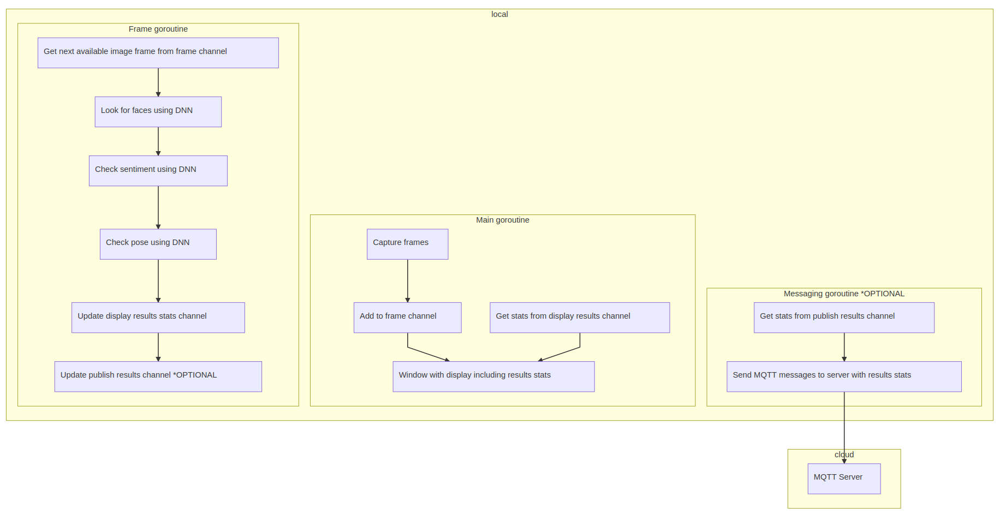

# Machine Operator Monitor

| Details            |              |
|-----------------------|---------------|
| Target OS:            |  Ubuntu* 16.04 LTS   |
| Programming Language: |  Google Go* programming language  |
| Time to Complete:    |  45 min     |


## Introduction

This machine operator monitor application is one of a series of reference implementations for Computer Vision (CV) using the Intel® Distribution of OpenVINO™ toolkit written in the Go* programming language. This application is designed for a machine mounted camera system intended to help ensure the machine operator safety. 

The system monitors if the operator is looking at the machine and if his emotional state is detected as angry. It sends an alert if either the operator is not watching the machine while it is in operation, or if their emotional state is angry and this combined state lasts for longer than a pre-defined period of time.

## Requirements

### Hardware

* 6th Generation Intel® Core™ processor with Intel® Iris® Pro graphics and Intel® HD Graphics

### Software

* [Ubuntu* 16.04 LTS](http://releases.ubuntu.com/16.04/)
*Note*: Run kernel versions 4.7+ to use this software. We recommend using a 4.14+ kernel to use this software. 
Determine the kernel version with the uname command in a shell: 

```shell
uname -a
```

* OpenCL™ Runtime Package
* Intel® Distribution of OpenVINO™ toolkit
* Go programming language v1.11+

## Setup

### Install Intel® Distribution of OpenVINO™ toolkit

Refer to [Install the Intel® Distribution of OpenVINO™ toolkit for Linux*](https://software.intel.com/en-us/articles/OpenVINO-Install-Linux) for more information about installation and setup.

The software requires the installation of OpenCL™ Runtime package to run inference on the GPU, as indicated in the following instructions. It is not mandatory for CPU inference.

### Install Go

Install the Go programming language version 1.11+ in order to compile this application. Obtain the latest compiler from the Go website's [download page.](https://golang.org/dl/)

For an excellent introduction to the Go programming language, see the [online tour.](https://tour.golang.org)

### Download the Reference Platform Code

Download the reference platform code onto your computer by using the "go get" command:

```shell
go get -d github.com/intel-iot-devkit/machine-operator-monitor-go
```

Change the current directory to the location where the application code is installed: 

```shell
cd $GOPATH/src/github.com/intel-iot-devkit/machine-operator-monitor-go
```

### Install Dependency Tool

This sample uses the `dep` dependency tool for Go. Download and install the tool:

```shell
make godep
```

### Install GoCV

After installing Go, install the [GoCV package](https://gocv.io/) which contains the Go programming language wrappers for Intel® Distribution of OpenVINO™ toolkit and the associated dependencies. The `dep` tool satisfies the program's dependencies as defined in `Gopkg.lock` file. To run, use:

```shell
make dep
```

Now you should be ready to build and run the reference platform application code.

## How It Works

The application uses a video source, such as a camera, to grab frames, and then uses 3 different Deep Neural Networks (DNNs) to process the data:

- The first network detects faces, and then if successful it passes the result to the second neural network.
- The second neural network is then used to determine if the machine operator is watching the machine (i.e., head position facing camera).
- Finally, if the proper head position has been detected, the third neural network performs facial analysis to determine the emotion of the detected operator face.

Optionally data can be sent to a MQTT machine to machine messaging server, as part of an industrial data analytics system.

This application uses a DNN model optimized for Intel® architecture. The model is part of the Intel® Distribution of OpenVINO™ toolkit.

Find the optimized models in these locations:

- `/opt/intel/computer_vision_sdk/deployment_tools/intel_models/face-detection-adas-0001`
- `/opt/intel/computer_vision_sdk/deployment_tools/intel_models/head-pose-estimation-adas-0001`
- `/opt/intel/computer_vision_sdk/deployment_tools/intel_models/emotions-recognition-retail-0003`



The program creates three several goroutines for concurrency:

- Main goroutine that performs the video i/o
- Worker goroutine that processes video frames using the deep neural networks
- Worker goroutine that publishes MQTT messages to remote server

## Set the Build Environment

Configure the environment to use the Intel® Distribution of OpenVINO™ toolkit one time per session:

```shell
source /opt/intel/computer_vision_sdk/bin/setupvars.sh
```

## Build the Code

Change the current directory to the location of the git-cloned application code. For example:

```shell
cd machine-operator-monitor-go
```

Before building the program, obtain its dependencies by running the commands below. The first one fetches `Go` depedency manager of our choice and the second uses it to satisfy the program's depdencies as defined in `Gopkg.lock` file:

```shell
make godep
make dep
```

After fetching dependencies, export a few environment variables required to build the library from the fetched dependencies. Run the  source command from the project directory:

```shell
source vendor/gocv.io/x/gocv/openvino/env.sh
```

To build the program binary, the project ships a simple `Makefile`. Invoke the `build` task from the project root as follows:

```shell
make build
```

This commands creates a new directory called `build` in the current working directory and places the newly built binary called `monitor` into it.

## Run the Code

To see a list of the various options:

```shell
cd build
./monitor -h
```

To run the application with all the needed models using the webcam:

```shell
./monitor -face-model=/opt/intel/computer_vision_sdk/deployment_tools/intel_models/face-detection-adas-0001/FP32/face-detection-adas-0001.bin -face-config=/opt/intel/computer_vision_sdk/deployment_tools/intel_models/face-detection-adas-0001/FP32/face-detection-adas-0001.xml -sent-model=/opt/intel/computer_vision_sdk/deployment_tools/intel_models/emotions-recognition-retail-0003/FP32/emotions-recognition-retail-0003.bin -sent-config=/opt/intel/computer_vision_sdk/deployment_tools/intel_models/emotions-recognition-retail-0003/FP32/emotions-recognition-retail-0003.xml -pose-model=/opt/intel/computer_vision_sdk/deployment_tools/intel_models/head-pose-estimation-adas-0001/FP32/head-pose-estimation-adas-0001.bin -pose-config=/opt/intel/computer_vision_sdk/deployment_tools/intel_models/head-pose-estimation-adas-0001/FP32/head-pose-estimation-adas-0001.xml
```

The user can choose different confidence levels for both face and emotion detection by using `-face-confidence`, `-sent-confidence` and `-pose-confidence` command line parameters. By default, all of these parameters are set to `0.5` (i.e., at least `50%` confidence is required in order for the returned inference result to be considered valid).

### Hardware Acceleration

This application can take advantage of the hardware acceleration in the Intel® Distribution of OpenVINO™ toolkit by using the `-backend, -b` and `-target, -t` parameters.

For example, to use the Intel® Distribution of OpenVINO™ toolkit backend with the GPU in 32-bit mode you need to set the `-backend` flag to `2` and `-target` flag to `1`:

```shell
./monitor -face-model=/opt/intel/computer_vision_sdk/deployment_tools/intel_models/face-detection-adas-0001/FP32/face-detection-adas-0001.bin -face-config=/opt/intel/computer_vision_sdk/deployment_tools/intel_models/face-detection-adas-0001/FP32/face-detection-adas-0001.xml -sent-model=/opt/intel/computer_vision_sdk/deployment_tools/intel_models/emotions-recognition-retail-0003/FP32/emotions-recognition-retail-0003.bin -sent-config=/opt/intel/computer_vision_sdk/deployment_tools/intel_models/emotions-recognition-retail-0003/FP32/emotions-recognition-retail-0003.xml -pose-model=/opt/intel/computer_vision_sdk/deployment_tools/intel_models/head-pose-estimation-adas-0001/FP32/head-pose-estimation-adas-0001.bin -pose-config=/opt/intel/computer_vision_sdk/deployment_tools/intel_models/head-pose-estimation-adas-0001/FP32/head-pose-estimation-adas-0001.xml -backend=2 -target=1
```

To run the code using 16-bit floats, set the `-target` flag to use the GPU in 16-bit mode. Also use the FP16 version of the Intel® models:

```shell
./monitor -face-model=/opt/intel/computer_vision_sdk/deployment_tools/intel_models/face-detection-adas-0001/FP16/face-detection-adas-0001.bin -face-config=/opt/intel/computer_vision_sdk/deployment_tools/intel_models/face-detection-adas-0001/FP16/face-detection-adas-0001.xml -sent-model=/opt/intel/computer_vision_sdk/deployment_tools/intel_models/emotions-recognition-retail-0003/FP16/emotions-recognition-retail-0003.bin -sent-config=/opt/intel/computer_vision_sdk/deployment_tools/intel_models/emotions-recognition-retail-0003/FP16/emotions-recognition-retail-0003.xml -pose-model=/opt/intel/computer_vision_sdk/deployment_tools/intel_models/head-pose-estimation-adas-0001/FP16/head-pose-estimation-adas-0001.bin -pose-config=/opt/intel/computer_vision_sdk/deployment_tools/intel_models/head-pose-estimation-adas-0001/FP16/head-pose-estimation-adas-0001.xml -backend=2 -target=2
```

To run the code using the VPU, set the `-target` flag to `3`. Also use the 16-bit FP16 version of the Intel® models:

```shell
./monitor -face-model=/opt/intel/computer_vision_sdk/deployment_tools/intel_models/face-detection-adas-0001/FP16/face-detection-adas-0001.bin -face-config=/opt/intel/computer_vision_sdk/deployment_tools/intel_models/face-detection-adas-0001/FP16/face-detection-adas-0001.xml -sent-model=/opt/intel/computer_vision_sdk/deployment_tools/intel_models/emotions-recognition-retail-0003/FP16/emotions-recognition-retail-0003.bin -sent-config=/opt/intel/computer_vision_sdk/deployment_tools/intel_models/emotions-recognition-retail-0003/FP16/emotions-recognition-retail-0003.xml -pose-model=/opt/intel/computer_vision_sdk/deployment_tools/intel_models/head-pose-estimation-adas-0001/FP16/head-pose-estimation-adas-0001.bin -pose-config=/opt/intel/computer_vision_sdk/deployment_tools/intel_models/head-pose-estimation-adas-0001/FP16/head-pose-estimation-adas-0001.xml -backend=2 -target=3
```

## Sample Videos

There are several sample videos that can be used to demonstrate the capabilities of this application. Download them by running these commands from the `machine-operator-monitor-go` directory:

```shell
mkdir resources
cd resources
wget https://github.com/intel-iot-devkit/sample-videos/raw/master/head-pose-face-detection-female.mp4
wget https://github.com/intel-iot-devkit/sample-videos/raw/master/head-pose-face-detection-male.mp4
cd ..
```

To then execute the code using one of these sample videos, run the following commands from the `machine-operator-monitor-go` directory:

```shell
./monitor -face-model=/opt/intel/computer_vision_sdk/deployment_tools/intel_models/face-detection-adas-0001/FP32/face-detection-adas-0001.bin -face-config=/opt/intel/computer_vision_sdk/deployment_tools/intel_models/face-detection-adas-0001/FP32/face-detection-adas-0001.xml -sent-model=/opt/intel/computer_vision_sdk/deployment_tools/intel_models/emotions-recognition-retail-0003/FP32/emotions-recognition-retail-0003.bin -sent-config=/opt/intel/computer_vision_sdk/deployment_tools/intel_models/emotions-recognition-retail-0003/FP32/emotions-recognition-retail-0003.xml -pose-model=/opt/intel/computer_vision_sdk/deployment_tools/intel_models/head-pose-estimation-adas-0001/FP32/head-pose-estimation-adas-0001.bin -pose-config=/opt/intel/computer_vision_sdk/deployment_tools/intel_models/head-pose-estimation-adas-0001/FP32/head-pose-estimation-adas-0001.xml -input=../resources/head-pose-face-detection-female.mp4
```

### Machine to Machine Messaging with MQTT

To use a MQTT server to publish data, set the following environment variables before running the program and use `-publish` flag when launching the program:

```shell
export MQTT_SERVER=localhost:1883
export MQTT_CLIENT_ID=cvservice
```

Change the `MQTT_SERVER` to a value that matches the MQTT server to which you are connected.

Change the `MQTT_CLIENT_ID` to a unique value for each monitoring station to track the data for individual locations. For example:

```shell
export MQTT_CLIENT_ID=machine1337
```

To monitor the MQTT messages sent to your local server, ensure the the `mosquitto` client utilities is installed and run the following command:

```shell
mosquitto_sub -t 'machine/safety'
```

### Docker*

To use the reference implementatino with Docker*, build a Docker image and then run the program in a Docker container. Use the `Dockerfile` present in the cloned repository to build the Docker image.

Follow the registration process for the Intel® Distribution of OpenVINO™ toolkit to obtain a unique download URL. A registration email  will be sent. It contains a link to the Intel Registration Center website download page, shown here:


Navigate to the download page using the link. On the download page, use the "Choose Product to Download" selection box and select "Intel® Distribution of OpenVINO™ toolkit for Linux*". Next, using the "Choose a Version" selection box, select "2018 R5". The "Choose a Download Option" section should appear. Right click on the button "Full Package" and choose "Copy Link Address". The clipboard should now contain a unique download URL. Save this URL somewhere safe.

Now build a unique Docker image by running the following command, substituting the actual URL obtained in the previous step:

```shell
docker build -t machine-operator-monitor-go --build-arg OPENVINO_DOWNLOAD_URL=[your unique OpenVINO download URL here] .
```

This will produce a Docker image called `machine-operator-monitor-go` which contains the built binary. Since the built Docker image has an [ENTRYPOINT](https://docs.docker.com/engine/reference/builder/#entrypoint) defined you can run the image as an executable using the following command:

```shell
docker run -it --rm machine-operator-monitor-go -h
```

To run the Docker image on an Ubuntu host machine using an attached camera, use:

```shell
xhost +local:docker
docker run --device=/dev/video0:/dev/video0 -v /tmp/.X11-unix:/tmp/.X11-unix -e DISPLAY=$DISPLAY -it --rm machine-operator-monitor-go -face-model=/opt/intel/computer_vision_sdk/deployment_tools/intel_models/face-detection-adas-0001/FP32/face-detection-adas-0001.bin -face-config=/opt/intel/computer_vision_sdk/deployment_tools/intel_models/face-detection-adas-0001/FP32/face-detection-adas-0001.xml -sent-model=/opt/intel/computer_vision_sdk/deployment_tools/intel_models/emotions-recognition-retail-0003/FP32/emotions-recognition-retail-0003.bin -sent-config=/opt/intel/computer_vision_sdk/deployment_tools/intel_models/emotions-recognition-retail-0003/FP32/emotions-recognition-retail-0003.xml -pose-model=/opt/intel/computer_vision_sdk/deployment_tools/intel_models/head-pose-estimation-adas-0001/FP32/head-pose-estimation-adas-0001.bin -pose-config=/opt/intel/computer_vision_sdk/deployment_tools/intel_models/head-pose-estimation-adas-0001/FP32/head-pose-estimation-adas-0001.xml
xhost -local:docker
```

To run the Docker image on an Ubuntu host machine using a file input, use:

```shell
xhost +local:docker
docker run -v ${PWD}/resources:/resources -v /tmp/.X11-unix:/tmp/.X11-unix -e DISPLAY=$DISPLAY -it --rm machine-operator-monitor-go -face-model=/opt/intel/computer_vision_sdk/deployment_tools/intel_models/face-detection-adas-0001/FP32/face-detection-adas-0001.bin -face-config=/opt/intel/computer_vision_sdk/deployment_tools/intel_models/face-detection-adas-0001/FP32/face-detection-adas-0001.xml -sent-model=/opt/intel/computer_vision_sdk/deployment_tools/intel_models/emotions-recognition-retail-0003/FP32/emotions-recognition-retail-0003.bin -sent-config=/opt/intel/computer_vision_sdk/deployment_tools/intel_models/emotions-recognition-retail-0003/FP32/emotions-recognition-retail-0003.xml -pose-model=/opt/intel/computer_vision_sdk/deployment_tools/intel_models/head-pose-estimation-adas-0001/FP32/head-pose-estimation-adas-0001.bin -pose-config=/opt/intel/computer_vision_sdk/deployment_tools/intel_models/head-pose-estimation-adas-0001/FP32/head-pose-estimation-adas-0001.xml -input=/resources/head-pose-face-detection-female.mp4
xhost -local:docker
```

### Microsoft Azure*

If you'd like to know how you can take advantage of more advanced build system provided by [Microsoft Azure Cloud](https://azure.microsoft.com/), please check out the Azure guide [here](./azure.md). Following the steps in the guide you can build a Docker container and push it into Azure Container Registry to make it available online.

## Related Reference Implementations

[Machine Operator Monitor CPP]https://github.com/intel-iot-devkit/machine-operator-monitor-cpp

